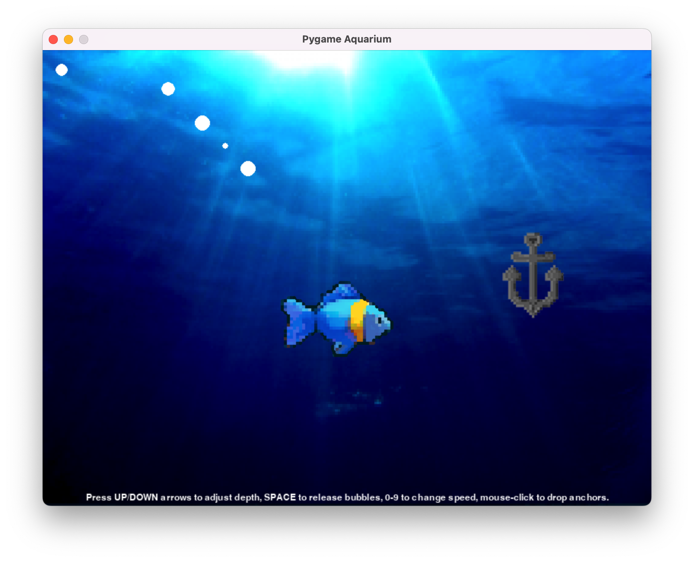

# Pygame User Input Example
This is an example demonstrating a [Level 4](#level-4) solution to the assignment outlined in the 
[Learning Objectives](#learning-objectives) section below.



The file [main_basic.py](main_basic.py) has the program written with without the use of functions and methods. 

The file [main_expert.py](main_expert.py) abstracts many of the steps as discrete functions and methods. You will notice the `while running:` loop is cleaner and easier to read. (It also uses a new data structure called a [dictionary](https://www.w3schools.com/python/python_dictionaries.asp) to store the key mapping for speed. A dictionary is a mutable, indexed container type similar to a list or tuple.)

### Notes on My Example
#### Functionality
I've written four types of visual or behavioural changes to satisfy [Level 4](#level-4) learning objectives. They are:

- KEYBOARD INPUT. Presing space releases bubbles from the fishh at its current location. The bubbles are random diameter and float upward. 

- KEYBOARD INPUT. The "depth" (or y-axis position) of the fish can be changed by pressing the up and down arrow keys.

- KEYBOARD INPUT. The numbers 0 through 9 change the swimming speed of the fish.

- MOUSE INPUT. Clicking the left-button anywhere in the window releases an anchor, which sinks to the bottom of the screen. Anchors are generated with random "weight", so they fall at different rates.

#### Tracking Multiple Instances with Lists
I used lists to track multiple instances of the same element. Here's how I did it in [main_basic.py](main_basic.py):

On L58, we initialize an empty list to track the bubbles:

```python
bubble_list = []
```

When the event handler detects the appropriate key press, we generate a new bubble
by getting the current coordinates of the fish and generating a random diameter.
We use the list `.append()` method to add this element to a list:

```python
bubble_x, bubble_y = dory.midleft
bubble_diameter = random.randint(3, 10)
bubble_list.append([bubble_x, bubble_y, bubble_diameter])
```

We now have a list of lists. After a few bubbles are generated, it might look something like this:

```python
print(bubble_list)  # Output: [[525, 126, 8], [475, 171, 7], [445, 201, 6]]
```

This means we have three bubbles on screen:

- Bubble 1 is at (x, y) = (525, 126) with radius 8
- Bubble 2 is at (x, y) = (475, 172) with radius 7
- Bubble 3 is at (x, y) = (445, 201) with radius 6

Later in the game loop, we iterate through the list to draw them, 
move them, and most importantly, remove them from the list once
they have moved off the edge of the screen:

```python
for bubble_item in bubble_list:
    bubble_x, bubble_y, bubble_diameter = bubble_item  # Unpack the tuple
    pygame.draw.circle(screen, WHITE, (bubble_x, bubble_y), bubble_diameter)  # Draw bubble
    bubble_item[1] -= 5  # Update bubble y-position
    if bubble_y <= 0:  # Remove bubbles from list at top of screen
        bubble_list.remove(bubble_item)
```

We use a similar method for the weighted anchors.

<br><br>
## Learning Objectives
In this task, you will learn about handling user input in Pygame.

## Task Description

Create a program that draws graphics for a scene or design. The graphics should change based on various user inputs. 

For example, you could create a garden drawing program in which:

- left-clicking creates flowers of random sizes and colors, 
- right-clicking spawns animated butterflies, and
- keyboard arrows up and down change the brightness of the sky, 
- keyboard numbers 1 through 9 change the speed of a lawnmower moving across the screen.

You can re-use methods from previous tasks defined to draw items to the screen (i.e flowers, clouds, etc). You can also incorporate sprites and background downloaded from [Open Game Art](https://opengameart.org/).

The objective is to demonstrate your ability to handle as many of the different input events as possible:

- mouse position
- mouse button clicks and releases
- key presses

## Assessment
### Level 1
Code features one (1) type of visual or behavioural change based on mouse and key events.

### Level 2
Code features two (2) unique types of visual or behavioural change based on mouse and key events. 

### Level 3
Code features three (3) unique types of visual or behavioural change based on mouse and key events. 

### Level 4
Code features four (4) or more unique types of visual or behavioural change based on mouse and key events. 

<br><br>

## Template File
The template file `main.py` has already been set up for you with a 800 by 600 screen. You can modify this as necessary.


<br><br>
## Submission
- Commit changes as you make incremental progress. Make sure to write meaningful commit messages.
- Sync or push your changes at the end of every work session or class.
- Finally, take a screenshot or video capture of your finished output window showing your design(s). Upload the screenshot or video to Classroom.
